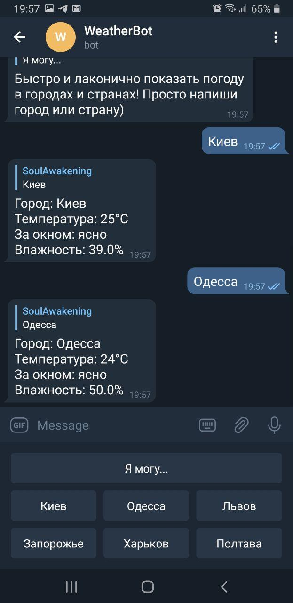
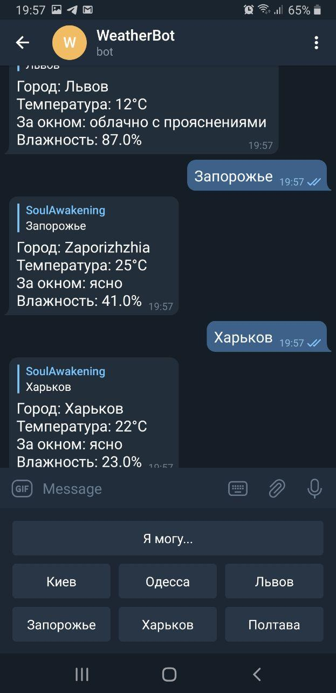
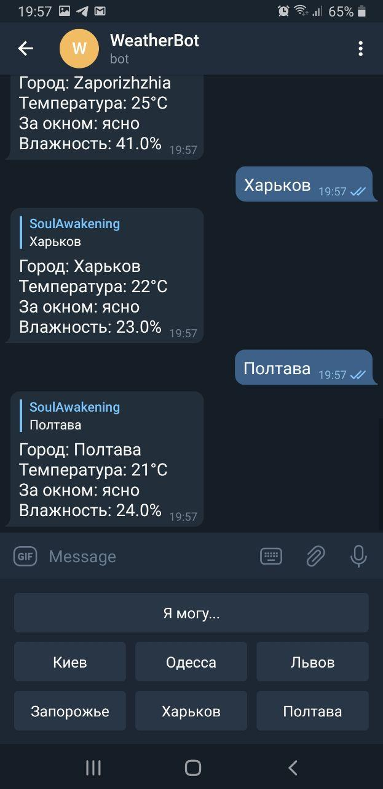
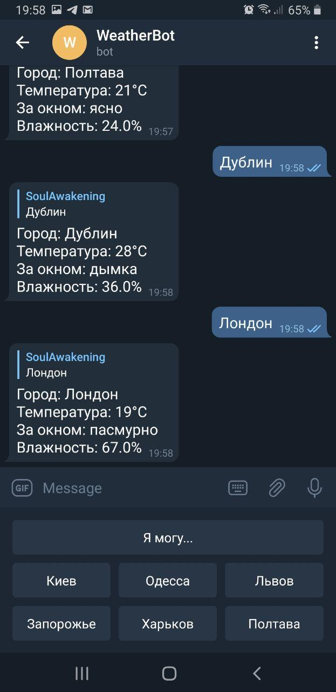
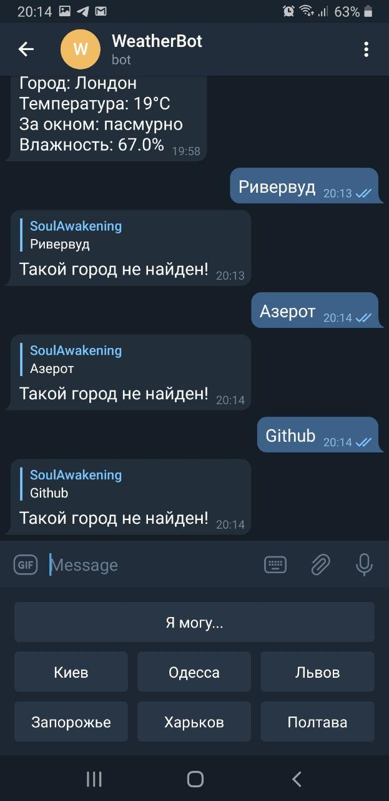

# API Телеграмм бот
## Отображает погоду в городах и странах

Бот создан с помощью **API openweathermap.org**
Так же была использована библиотека **JSON**

При старте работы предусмотрено приветствие. Так же реализована кнопка **Я могу...** чтоб напомнить функционал бота.

 
 
 

Так же для удобства реализована клавиатура с несколькими крупными городами Украины.

Бот **отвечает** пользователю сообщением с такими **пунктами** как:

**Сообщение бота** |
------------ |
Город  |
Температура| 
Погодные условия|
Влажность|

Бот сообщает погоду в конкретное время.

Если ввести **несуществующий город** - бот ответит: **Такого города не существует!**

Запустите робота с помощью **Telegrambot_weather.jar** файла.

Команда для запуска: **java -jar Telegrambot_weather.jar**
