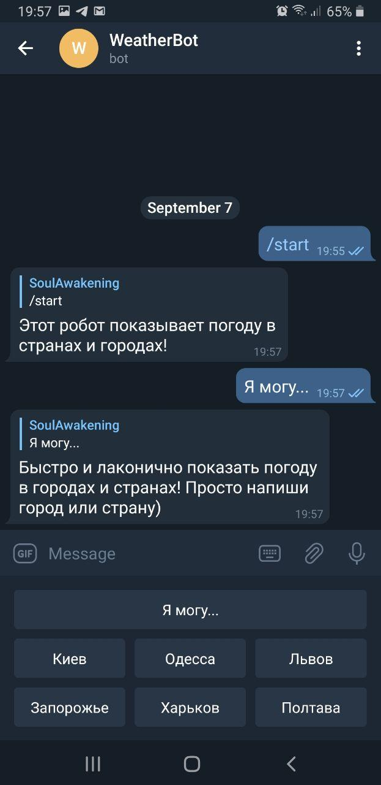

# API Telegram bot
## Displays the weather in cities and countries

Bot was created with **API openweathermap.org**
Also was used library **JSON**

At the start of work, is provided greeting. **Я могу...** button is also implemented to remind the bot functionality.

For convenience, there are keyboard with several major cities of Ukraine implemented.

The bot **replies** to the user with such message as:

**Bot message** |
------------ |
City |
Temperature |
Weather conditions |
Humidity |

The bot reports the weather now.

If you enter ** non-existent city ** - the bot will answer: **Такого города не найден!**

Start the robot with **Telegrambot_weather.jar** file.
Command to run: **java -jar Telegrambot_weather.jar**
